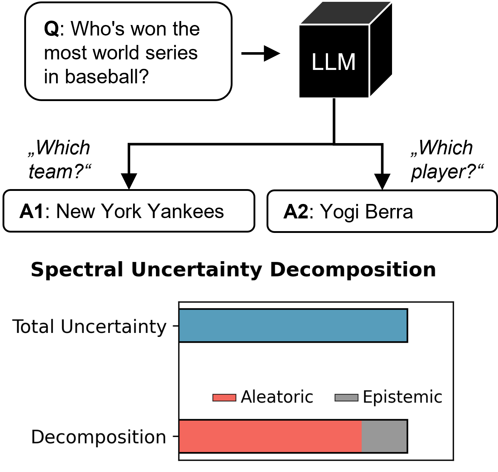

# Spectral Uncertainty
This repo is our official implementation of the paper "Fine-Grained Uncertainty Decomposition in Large Language Models: A Spectral Approach" as well as the baselines we compare to. 



All results and plots in the paper can be reproduced by running this repo. <br>
**Paper arXiv:** https://arxiv.org/abs/2509.22272


## Requirements
First, create a virtual environment with python 3.12 and install all requirements using
```bash 
pip install -r requirements.txt
```

## Environment variables
In order for the code to run properly, you need to set the following environment variable before launching the experiments:

- HF_CACHE: Path for storing huggingface models.
- OPENAI_API_KEY: API key for openai. Necessary for `GPT-4o` and `GPT-4.1` calls.
- GROQ_API_KEY: API key. Necessary for `Llama 4 Maverick` calls.

## Running the pipeline for aleatoric uncertainty evaluations
### 1. **Generate Clarifications**

Start by generating the input clarifications using gpt_4o. The second line just copies the original input in the clarifications directory, to serve as input for baselines that do not need clarification.

```bash
python generate_ensemble.py --config_path configs/generate_ensemble/clarification_zeroshot/AmbigInst-clarification_zeroshot.yaml
python generate_ensemble.py --config_path configs/generate_ensemble/no_ensembling/AmbigInst-no_ensembling.yaml
```

---

### 2. **Generate Model Answers (No Ensembling)**

Run target model answer generation for the no-ensembling (no clarification baselines) case using both Phi-4 14B and Llama 4 Maverick.

```bash
python generate_model_answers.py --config_path configs/generate_model_answers/no_ensembling/AmbigInst-no_ensembling-Llama_4_maverick.yaml
python generate_model_answers.py --config_path configs/generate_model_answers/no_ensembling/AmbigInst-no_ensembling.yaml
```

---

### 3. **Generate Model Answers (Clarification-based)**

Repeat model answer generation for the clarification-based methods.

```bash
python generate_model_answers.py --config_path configs/generate_model_answers/clarification_zeroshot/AmbigInst-clarification_zeroshot-Llama4_maverick.yaml
python generate_model_answers.py --config_path configs/generate_model_answers/clarification_zeroshot/AmbigInst-clarification_zeroshot.yaml
```

---

### 4. **Compute Uncertainty (With Embeddings)**

Compute uncertainty using embeddings for all configurations (clarification and no-ensembling, Phi 4 or Llama 4). This is for uncertainty methods that use embeddings (predictive kernel entropy, spectral uncertainty).

```bash
python compute_uncertainty_w_embeddings.py --config_path configs/compute_uncertainty/w_embeddings/AmbigInst-no-llama4_maverick.yaml
python compute_uncertainty_w_embeddings.py --config_path configs/compute_uncertainty/w_embeddings/AmbigInst-no.yaml
python compute_uncertainty_w_embeddings.py --config_path configs/compute_uncertainty/w_embeddings/AmbigInst-zeroshot-llama4_maverick.yaml
python compute_uncertainty_w_embeddings.py --config_path configs/compute_uncertainty/w_embeddings/AmbigInst-zeroshot.yaml
```

---

### 5. **Compute Uncertainty (Without Embeddings)**

Finally, compute uncertainty without using embeddings for the same configuration set. This is for uncertainty methods that do not use embeddings (semantic entropy, kernel language entropy, input clarification ensembling).

```bash
python compute_uncertainty_wo_embeddings.py --config_path configs/compute_uncertainty/wo_embeddings/AmbigInst-no-llama4_maverick.yaml
python compute_uncertainty_wo_embeddings.py --config_path configs/compute_uncertainty/wo_embeddings/AmbigInst-no.yaml
python compute_uncertainty_wo_embeddings.py --config_path configs/compute_uncertainty/wo_embeddings/AmbigInst-zeroshot-llama4_maverick.yaml
python compute_uncertainty_wo_embeddings.py --config_path configs/compute_uncertainty/wo_embeddings/AmbigInst-zeroshot.yaml
```

### 6. **Repeat the above steps for AmbigQA**
Replace `AnbigInst` in the above instructions by `AmbigQA` and rerun.

### 7. **Evaluate the results**
Run the cells in the notebook `evaluation_aleatoric.ipynb` to generate scores and plots for aleatoric uncertainty.


## Running the pipeline for total uncertainty evaluations

### 1. **Generate Clarifications**

Start by generating the input clarifications using gpt\_4o. The second line just copies the original input into the clarifications directory, to serve as input for baselines that do not use clarification.

```bash
python generate_ensemble.py --config_path configs/generate_ensemble/clarification_zeroshot/TriviaQA-clarification_zeroshot.yaml
python generate_ensemble.py --config_path configs/generate_ensemble/no_ensembling/TriviaQA-no_ensembling.yaml
```

---

### 2. **Generate Model Answers (No Ensembling)**

Run target model answer generation for the no-ensembling (no clarification baselines) case using both Phi-4 14B and Llama 4 Maverick.

```bash
python generate_model_answers.py --config_path configs/generate_model_answers/no_ensembling/TriviaQA-no_ensembling-Llama_4_maverick.yaml
python generate_model_answers.py --config_path configs/generate_model_answers/no_ensembling/TriviaQA-no_ensembling.yaml
```

---

### 3. **Generate Model Answers (Clarification-based)**

Repeat model answer generation for the clarification-based methods.

```bash
python generate_model_answers.py --config_path configs/generate_model_answers/clarification_zeroshot/TriviaQA-clarification_zeroshot-Llama4_maverick.yaml
python generate_model_answers.py --config_path configs/generate_model_answers/clarification_zeroshot/TriviaQA-clarification_zeroshot.yaml
```

---

### 4. **Generate Standard Answers**

Generate standard model outputs (standard answers that will be used to generate the ground truth for prediction correctness) for both Llama 4 Maverick and Phi-4 14B. These are the "most likely" answers of the target model to the original questions.

```bash
python generate_model_standard_answers_predictive.py --config_path configs/generate_model_standard_answers_predictive/TriviaQA-llama4_maverick.yaml
python generate_model_standard_answers_predictive.py --config_path configs/generate_model_standard_answers_predictive/TriviaQA-phi_4.yaml
```

---

### 5. **Judge Correctness of Standard Answers**

Use the correctness judge to determine the correctness of each sampled answer. GPT 4.1 here decides if the standard answer is correct or not.

```bash
python correctness_judge_predictive.py --config_path configs/correctness_judge/TriviaQA-llama4_maverick.yaml
python correctness_judge_predictive.py --config_path configs/correctness_judge/TriviaQA-phi_4.yaml
```

---

### 6. **Compute Uncertainty (With Embeddings)**

Compute uncertainty using embeddings for all configurations (clarification and no-ensembling, Phi 4 or Llama 4). This includes methods relying on embeddings (predictive kernel entropy, spectral uncertainty).

```bash
python compute_uncertainty_w_embeddings.py --config_path configs/compute_uncertainty/w_embeddings/TriviaQA-no-llama4_maverick.yaml
python compute_uncertainty_w_embeddings.py --config_path configs/compute_uncertainty/w_embeddings/TriviaQA-no.yaml
python compute_uncertainty_w_embeddings.py --config_path configs/compute_uncertainty/w_embeddings/TriviaQA-zeroshot-llama4_maverick.yaml
python compute_uncertainty_w_embeddings.py --config_path configs/compute_uncertainty/w_embeddings/TriviaQA-zeroshot.yaml
```

---

### 7. **Compute Uncertainty (Without Embeddings)**

Compute uncertainty without using embeddings. This includes methods that don't use embeddings (semantic entropy, kernel language entropy, and input clarification ensembling).

```bash
python compute_uncertainty_wo_embeddings.py --config_path configs/compute_uncertainty/wo_embeddings/TriviaQA-no-llama4_maverick.yaml
python compute_uncertainty_wo_embeddings.py --config_path configs/compute_uncertainty/wo_embeddings/TriviaQA-no.yaml
python compute_uncertainty_wo_embeddings.py --config_path configs/compute_uncertainty/wo_embeddings/TriviaQA-zeroshot-llama4_maverick.yaml
python compute_uncertainty_wo_embeddings.py --config_path configs/compute_uncertainty/wo_embeddings/TriviaQA-zeroshot.yaml
```

---

### 8. **Repeat the above steps for Natural Questions**

Replace `TriviaQA` in the above instructions with `OpenNQ` and rerun the full pipeline.

---

### 9. **Evaluate the results**

Run the cells in the notebook `evaluation_predictive.ipynb` to generate scores and plots for total uncertainty evaluation.


## Citation
If you found this work or code useful, please cite:

```
@article{walha2025fine,
  title={Fine-Grained Uncertainty Decomposition in Large Language Models: A Spectral Approach},
  author={Walha, Nassim and Gruber, Sebastian G and Decker, Thomas and Yang, Yinchong and Javanmardi, Alireza and H{\"u}llermeier, Eyke and Buettner, Florian},
  journal={arXiv preprint arXiv:2509.22272},
  year={2025}
}
```


## License

Everything is licensed under the [MIT License](https://opensource.org/licenses/MIT).